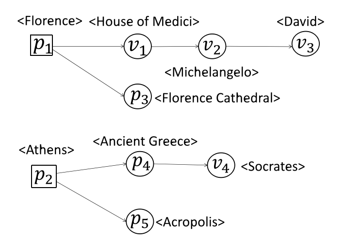
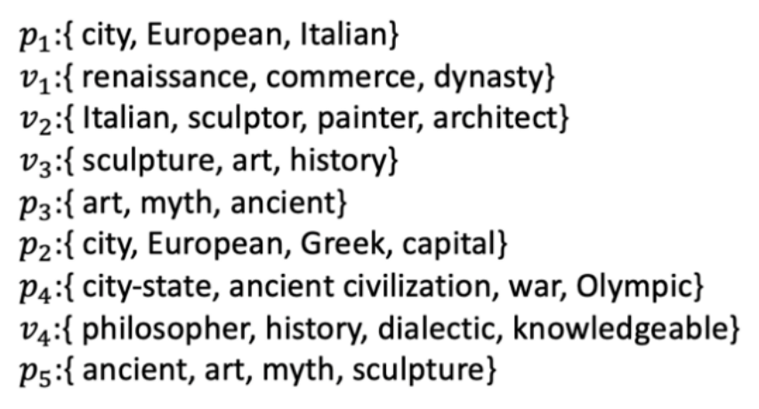

# Skyline query based on RDF graph

### 1. RDF Graph

***

 **Define：**

1. A directed graph $ G=(V,E) $ ,$ V $ is for the set of vertices, and $ E $ is for the set of edges in the graph.

2. $ V $ contains two types of vertices：site vertices $p_i$ and non-site vertices $v_i$.

3. $p_i$：spatial coordinate attributes and text attrubutes.

   $v_i$：text attrubutes. (write for $v.\psi$)

RDF Graph example:

Text attributes:

Spatial coordinate attributes:
$$
\begin{aligned}
p_1:&\{33.84833,\  35.58278\}\\
p_2:&\{30.37917,\  70.34861\}\\
p_3:&\{-19.81667,\  -68.31667\}\\
p_4:&\{20.71722,\  104.06806\}\\
p_5:&\{34.24509,\  -97.24807\}
\end{aligned}
$$

### 2. Relevant Semantic Location

***

**Define:**

1. Given a set of keywords $\phi$ and a RDF graph $ G=(V,E) $ 

2. The semantic location $p$ associated with  $\phi$  is a tree with $p$ as its root node, writing for $T_p=(V',E')$,which needs for satisfy the conditions：$V'\subseteq V,E'\subseteq E,U_{v\in V},v.\psi \supseteq \phi$

   This means that the union of all text attributes belonging to the vertices of the $T_P$ contains $\phi$.

3. The distance between $p$ to $w_i\in\phi$ in $T_p$：
   $$
   d_g(T_p,w_i)=\min_{v\in V'}d(p,v),w_i\in v.\psi
   $$
   where $d(p,v)$ is the length of the shortest path from $p$ to $v$ in $T_p$.

### 3. Semantic Location Domination

***

**Define:**

1. Given a set of keywords $\phi$ and a RDF graph $ G=(V,E) $ 

2. $ T=\{T_{p_i}\}$, semantic location domination is a partial order relation over $T$, given $T_{p_1}\in T$, $T_{p_2}\in T$ ,if  they satisfy the following two conditions：
   $$
   \exist w_i\in \phi, d_g(T_{p_1},w_i)\lt d_g(T_{p_2},w_i)\\
   \forall w_i\in \phi, d_g(T_{p_1},w_i)\le d_g(T_{p_2},w_i)
   $$
   then $T_{p_1}$ dominates $T_{p_2}$, writing for $T_{p_1}\prec T_{p_2}$

 

### 4. Skyline Query

***

**Define:**

1. Given a set of keywords $\phi$ and a RDF graph $ G=(V,E) $ 
2. $ T=\{T_{p_i}\}$ ,if $T_{p_i}\in T$ and  $\forall T_{p_j}\in T\ \  i\ne j,T_{p_j}\not\prec T_{p_i}$, then we call $p_i$ is a skyline semantic Location (or skyline point, SP)
3. Skyline query result is a set $S(G,\phi)=\{p_i\},\ p_i$ is a skyline point.